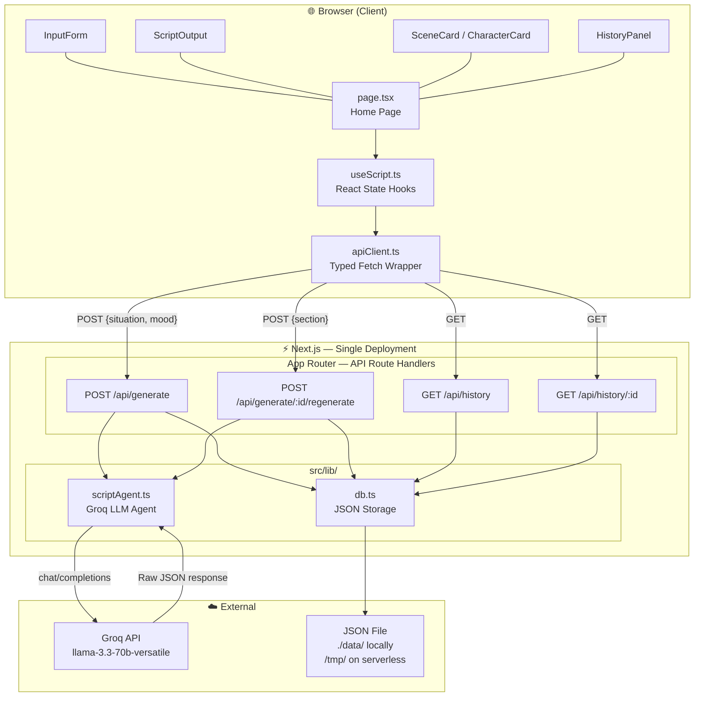
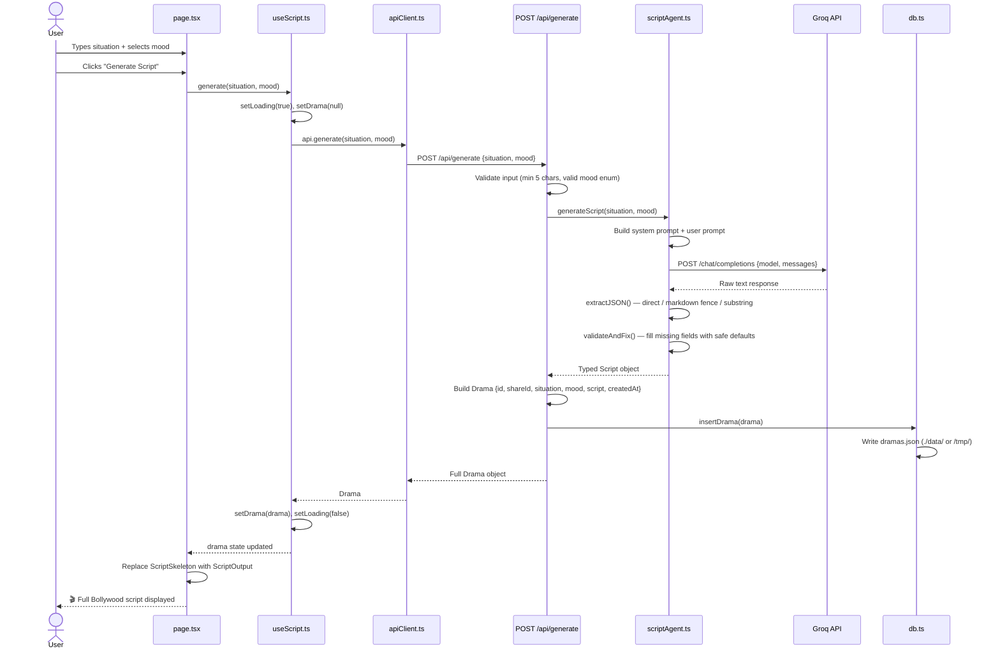
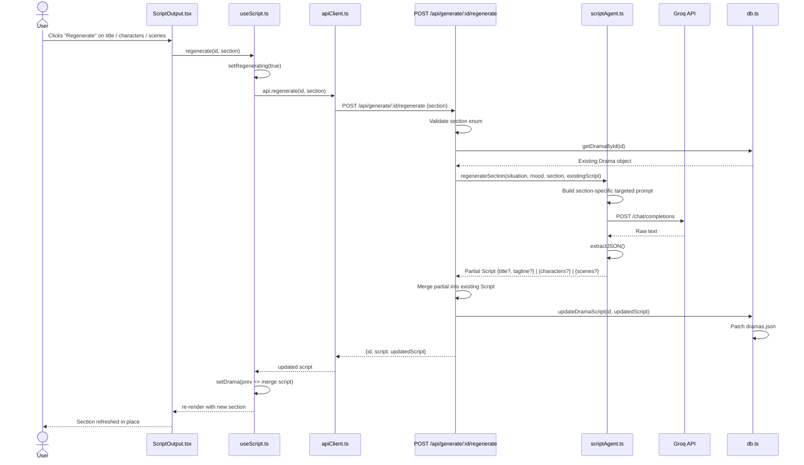

# 🎬 MASALAWOOD — Bollywood Script Generator

> Turn any ordinary situation into an epic Bollywood blockbuster. Powered by AI. Fueled by drama.

---

## Features

| Feature |
|---|
| Situation input → title, tagline, and full multi-scene script
| LLM agent with structured JSON output + extraction fallbacks
| Scene index, description, dialogue, and music cues
| Character cards with name, role, and traits
| Mood selector — 6 moods (Dramatic, Romantic, Comedy, Action, Tragic, Thriller)
| Regenerate title, characters, or scenes independently
| History drawer — persisted across sessions |
| Skeleton loading states, error handling, fully responsive |

---

## Tech Stack

| | |
|---|---|
| Framework | Next.js 14 (App Router) |
| Language | TypeScript (strict mode) |
| UI | React 18, Tailwind CSS v3, Framer Motion, Lucide |
| AI | Groq API (`llama-3.3-70b-versatile`) |
| Storage | JSON file — `./data/` locally, `/tmp/` on serverless |

---

## Project Structure

```
src/
├── app/
│   ├── layout.tsx                       # Root layout — fonts, Toaster
│   ├── page.tsx                         # Home page
│   ├── globals.css                      # Design tokens, skeleton animation
│   └── api/
│       ├── generate/route.ts            # POST /api/generate
│       ├── generate/[id]/regenerate/    # POST /api/generate/:id/regenerate
│       ├── history/route.ts             # GET  /api/history
│       └── history/[id]/route.ts        # GET  /api/history/:id
├── lib/
│   ├── scriptAgent.ts                   # Groq LLM agent — prompt + JSON parsing
│   ├── db.ts                            # JSON file storage (local or /tmp)
│   └── apiClient.ts                     # Browser-side typed fetch wrapper
├── hooks/
│   └── useScript.ts                     # useScript + useHistory React hooks
├── components/
│   ├── InputForm.tsx
│   ├── ScriptOutput.tsx
│   ├── ScriptSkeleton.tsx               # Shimmer skeleton while generating
│   ├── SceneCard.tsx
│   ├── CharacterCard.tsx
│   └── HistoryPanel.tsx
└── types/
    └── index.ts                         # Shared domain types
```

---

## Setup & Running Locally

### Prerequisites
- Node.js 18+
- A Groq API key — free at [console.groq.com](https://console.groq.com)

### 1. Clone & install

```bash
git clone <repo-url>
cd <repo-folder>
npm install
```

### 2. Configure environment

```bash
cp .env.example .env.local
```

Edit `.env.local`:

```env
GROQ_API_KEY=your_groq_api_key_here
GROQ_MODEL=llama-3.3-70b-versatile
```

`GROQ_MODEL` is optional — defaults to `llama-3.3-70b-versatile`.

### 3. Run

```bash
npm run dev
```

Open [http://localhost:3000](http://localhost:3000) 🎬

### Production build

```bash
npm run build
npm start
```

### Type check

```bash
npm run typecheck
```

---

## Architecture Diagram



---

## Sequence Diagram — Script Generation



---

## Sequence Diagram — Regenerate a Section


