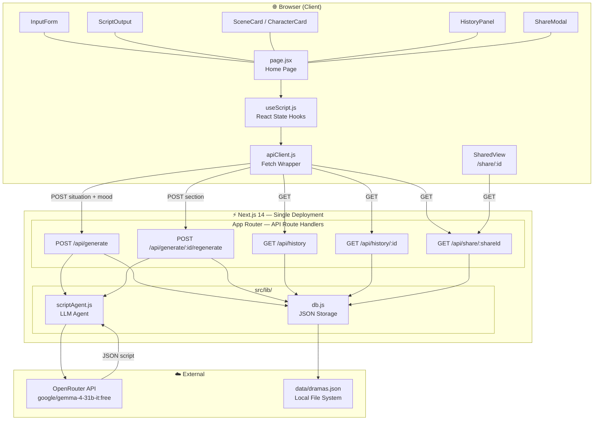
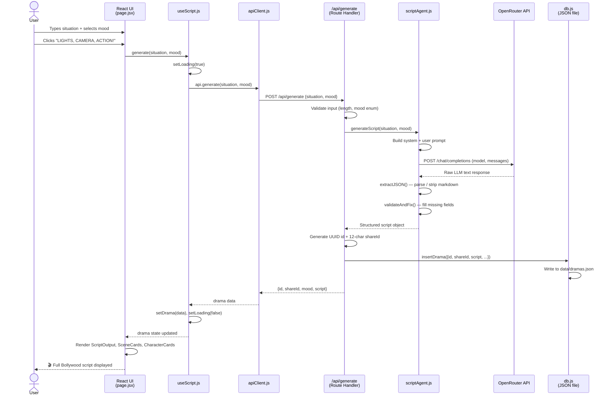
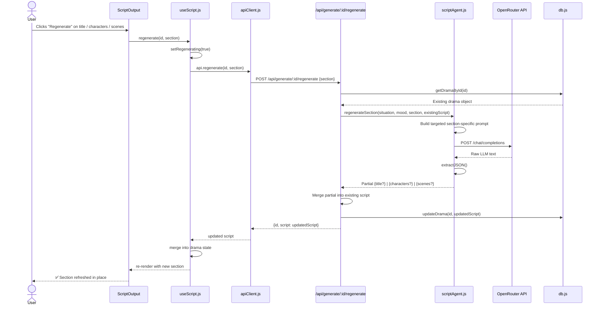

# 🎬 Bollywood Script Generator — MASALAWOOD

> Turn any ordinary situation into an epic Bollywood blockbuster. Powered by AI. Fueled by drama.

---

## Features

| Feature | |
|---|---|
| Situation input → title + tagline + multi-scene script 
| LLM agent with structured JSON output + extraction fallbacks 
| Scene index, description, dialogue, music cues 
| Character cards (name, role, traits)
| Scene mood selector (6 moods)
| Regenerate title, characters, or scenes independently
| History drawer (persisted to local JSON file)
| Shareable public link `/share/:id`
| Error handling (client + server)
| Responsive UI

---

## Tech Stack

| | |
|---|---|
| Framework | Next.js 14 (App Router) |
| UI | React 18, Tailwind CSS, Framer Motion, Lucide |
| AI | OpenRouter API (any free or paid model) |
| Storage | JSON file (`data/dramas.json`) — zero setup |

---

## Project Structure

```
src/
├── app/
│   ├── layout.jsx                      # Root layout (fonts, Toaster)
│   ├── page.jsx                        # Home page
│   ├── globals.css
│   ├── share/[shareId]/page.jsx        # Public share page
│   └── api/
│       ├── generate/route.js           # POST /api/generate
│       ├── generate/[id]/regenerate/   # POST /api/generate/:id/regenerate
│       ├── history/route.js            # GET  /api/history
│       ├── history/[id]/route.js       # GET  /api/history/:id
│       └── share/[shareId]/route.js    # GET  /api/share/:shareId
├── lib/
│   ├── scriptAgent.js                  # LLM agent (prompt + JSON extraction)
│   ├── db.js                           # JSON file storage
│   └── apiClient.js                    # Browser-side fetch wrapper
├── hooks/
│   └── useScript.js                    # React state hooks
└── components/
    ├── InputForm.jsx
    ├── ScriptOutput.jsx
    ├── SceneCard.jsx
    ├── CharacterCard.jsx
    ├── HistoryPanel.jsx
    ├── ShareModal.jsx
    └── SharedView.jsx
```

---

## Setup & Running Locally

### Prerequisites
- Node.js 18+
- An OpenRouter API key — free at [openrouter.ai](https://openrouter.ai)

### 1. Clone

```bash
git clone <repo-url>
cd <repo-folder>
```

### 2. Install dependencies

```bash
npm install
```

### 3. Configure environment

```bash
cp .env.example .env.local
```

Edit `.env.local`:

```env
OPENROUTER_API_KEY=your_key_here
OPENROUTER_MODEL=google/gemma-4-31b-it:free
```

**Free models on OpenRouter:**
- `google/gemma-4-31b-it:free`
- `openrouter/openai/gpt-oss-120b:free`
- `nvidia/nemotron-3-super-120b-a12b:free`

### 4. Run

```bash
npm run dev
```

Open [http://localhost:3000](http://localhost:3000) 🎬

### Production build

```bash
npm run build
npm start
```

---

## Architecture Diagram



---

## Sequence Diagram — Script Generation



---

## Sequence Diagram — Regenerate a Section



---

## AI Engineering Notes

- **Prompt:** System prompt establishes the MASALAWOOD persona with explicit Bollywood tropes, Hindi exclamations, and music cue formatting. User prompt injects mood-specific style guidance.
- **Structured output:** LLM is instructed to return raw JSON only. `extractJSON()` in `scriptAgent.js` handles markdown fences and partial extraction gracefully.
- **Validation:** `validateAndFix()` gives safe defaults to any missing fields so the UI never crashes on a partial LLM response.
- **Targeted regeneration:** Each section (title, characters, scenes) has its own focused prompt so token usage stays low and responses stay relevant.
